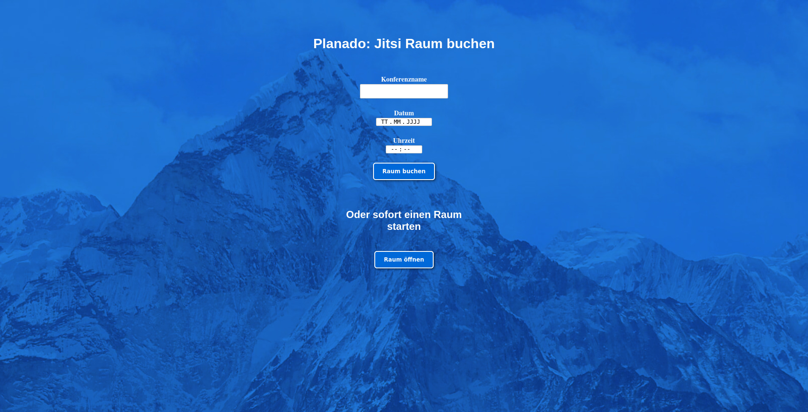
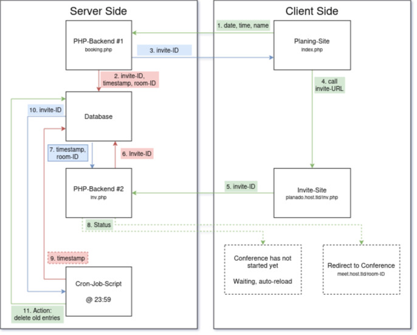
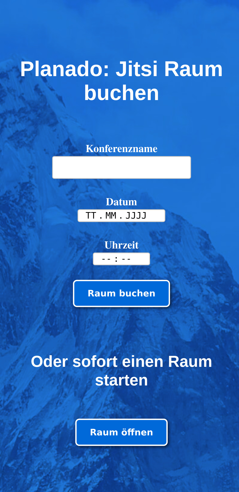
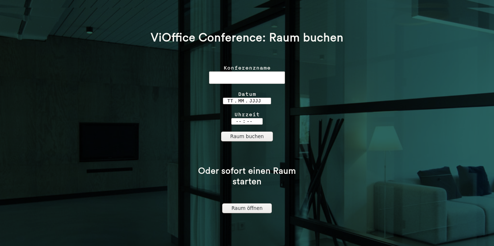
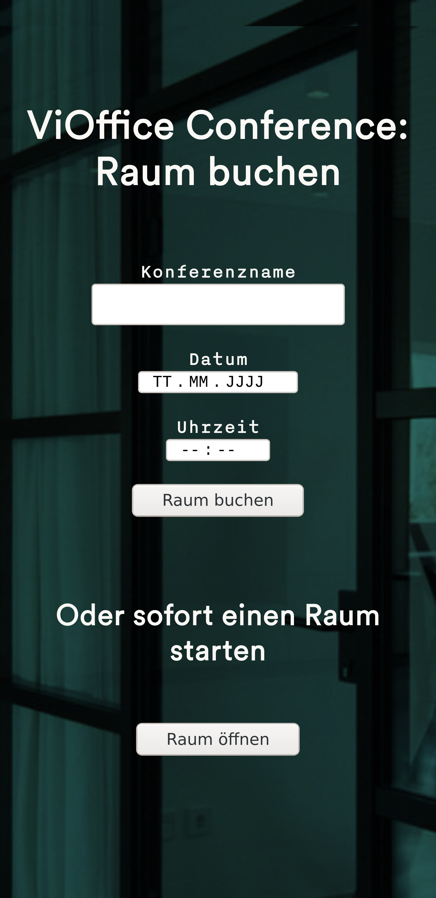

# Planado Documentation

## What is Planado?

Planado is intended as a simple, lightweight and easy to host planing and room
reservation tool for Jitsi-Meet.

We felt the need to be able to plan Videoconferences in Jitsi-Meet, where it is
possible to publicly post an invite link without someone else being able to
occupy the designated room. Of course the essence of Jitsi-Meet with broad
anonymity of the users and temporary rooms on-demand should still be preserved.

We came up with an easy solution called "Planado"! All it does is offering a
unique, extremely hard to guess Jitsi-Meet room and a secondary invite-URL which
you can post publically, but which does not allow to know the rooms name before
the conference starts.

The beauty of Planado lies within the fact, that there are no special
requirements on the Jitsi-Meet side. In fact, the Jitsi-Meet instance does not
even need to be aware of Planado at all. This means, that one may host Planado
for other, public Jitsi-Meet instances. No additional stress is put onto these
Jitsi-Meet instances and no special configurations are required.

A properly configured instance of Planado stores data only temporary, until the
meeting is over. Additionally, as little information as possible is stored and
none of the information is either confidential or personal. Hence Plenado is
GPDR compliant and privacy aware by default. It respects the user's right for
informational self-determination and does not track users. It does only one
simple job and nothing else.

## How does it work on the technical side?

Planado is a relatively simple construct. In essence, it consists of a simple
form, where users plan their meetings (`index.php`), a script that _books_ the
meeting and returns some invite-URL to the user (`booking.php`) which then can
be forwarded to others. This script also communicates to a database, storing the
room-ID, the invite-ID and the time-stamp the meeting is supposed to start at.

## More Screenshots!

### Default Planado setup

Use it in action here: [planado.vioffice.de](https://planado.vioffice.de)

### A slightly configured setup

As used for [ViOffice](https://www.vioffice.de), where this project started to
exist: [conference.vioffice.de](https://conference.vioffice.de) (not public)

